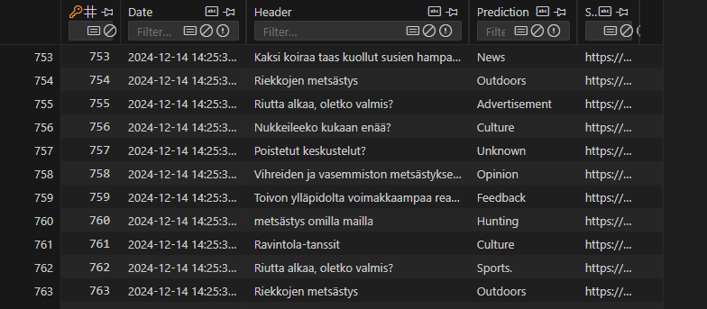

### Web scraper Implementation with OpenAI

This Web scraper application is designed to scrape selected websites and collect topics. It uses AI to analyze and predict the categorization of the collected topics. The analysis and scraped data are stored in an SQLite database. Additionally, the application provides an API that can be used to extract data for frontend applications and other purposes. This app is primarily designed to run locally and operates via the command line.

Potential use cases include detecting ongoing discussions and identifying emerging trends. With minimal to no refactoring, you can also filter results to track specific topics or keywords, such as 'X' or 'Y', to see if they are being mentioned.

## Technologies
- C# (.NET 9.0)
- Web scraping (HTML Agility Pack)
- SQLite database
- OpenAI
- APIs
- Github Actions
- Unit tests

## Installation

1. Clone the repository:
```bash
   git clone https://github.com/jannepaakkari/Web-scraper.git
   cd app/WebScraper
```

- Set up .env file at the root of the WebScraper folder and add `OPENAI_API_KEY='your_key'`
- Modify `appsettings.json` at the root of the WebScraper folder:
```bash
    "Url": Set url you want to scrape,
    "RunAPI": Set true you want to run APIs, not neccessary for scraper itself,
    "ScrapingNodes": Nodes you want to scrape, depends on site what you should add here, by default we scrape headers,
```

3. Restore dependencies:
```bash
dotnet restore
```

4. Build the project:
```bash
dotnet build
```

5. Run the application:
```bash
dotnet run
```

6. To apply the latest database migrations, use the following command:
```bash
dotnet ef database update
```

## Usage

1. After you have successfully run the application (`dotnet run` in the `cd app/WebScraper` directory), you can view the content from `HeadersDatabase.db`.
2. You can also use the API endpoint `/api/content` to view the content. Make sure `RunAPI` is set to `true` in `appsettings.json` before running the app.
3. You can run tests at the root using:
```bash
dotnet test App.sln
```

## Screenshots
